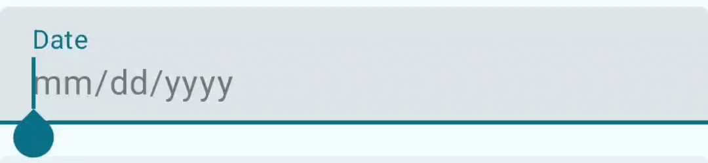
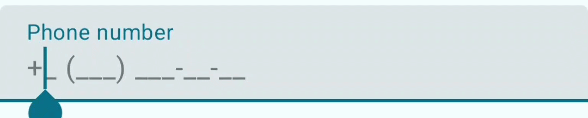

# Custom mask for Jetpack Compose TextField





You can use **MaskVisualTransformation** this way for digits-only input:
```kotlin
        // An initial value of the input
        var value by remember { mutableStateOf("")}
        val onValueChange: (String) -> Unit  = { value = it }
        // Your visible mask
        val mask = remember { "mm/dd/yyyy" }
        // The array of the delimiters in your mask
        val delimiters = remember { charArrayOf('/') }
        // Calculate max input length by your mask
        val maxInputLength = remember { mask.split(delimiters = delimiters).sumOf { it.length } }

        TextField(
            value = value,
            onValueChange = { newValue ->
                // Filter non-digit characters and enforce max length
                val filteredText = newValue.filter { it.isDigit() }.take(maxInputLength)
                onValueChange(filteredText)
            },
            keyboardOptions = KeyboardOptions(keyboardType = KeyboardType.Number),
            visualTransformation = MaskVisualTransformation(
                mask = mask,
                delimiters = delimiters,
                textColor = MaterialTheme.colorScheme.onSurface,
                maskColor = MaterialTheme.colorScheme.outline
            ),
        )
```
or this way for other cases:
```kotlin
        // An initial value of the input
        var value by remember { mutableStateOf("")}
        val onValueChange: (String) -> Unit  = { value = it }
        // Your visible mask
        val mask = remember { "(___) ___-__-__" }
        // The array of the delimiters in your mask
        val delimiters = remember { charArrayOf(' ', '(', ')', '-') }
        // Calculate max input length by your mask
        val maxInputLength = remember { mask.split(delimiters = delimiters).sumOf { it.length } }

        TextField(
            value = value,
            onValueChange = { newValue ->
                // Enforce max length
                onValueChange(newValue.take(maxInputLength))
            },
            visualTransformation = MaskVisualTransformation(
                mask = mask,
                delimiters = delimiters,
                textColor = MaterialTheme.colorScheme.onSurface,
                maskColor = MaterialTheme.colorScheme.outline
            ),
        )
```

More examples:
- [MaskedTextField](app/src/main/java/com/kuzepa/masktextfieldcompose/ui/composable/MaskedTextField.kt)
- [OnlyDigitsMaskedTextField](app/src/main/java/com/kuzepa/masktextfieldcompose/ui/composable/OnlyDigitsMaskedTextField.kt)
- [Usage of the above examples](app/src/main/java/com/kuzepa/masktextfieldcompose/MainActivity.kt)
